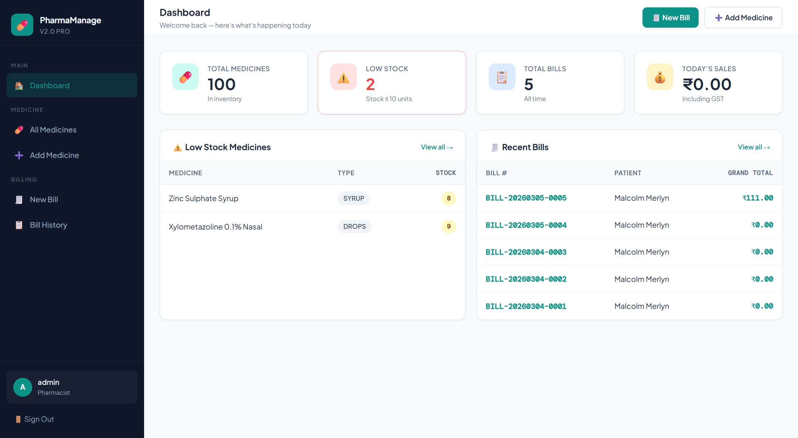
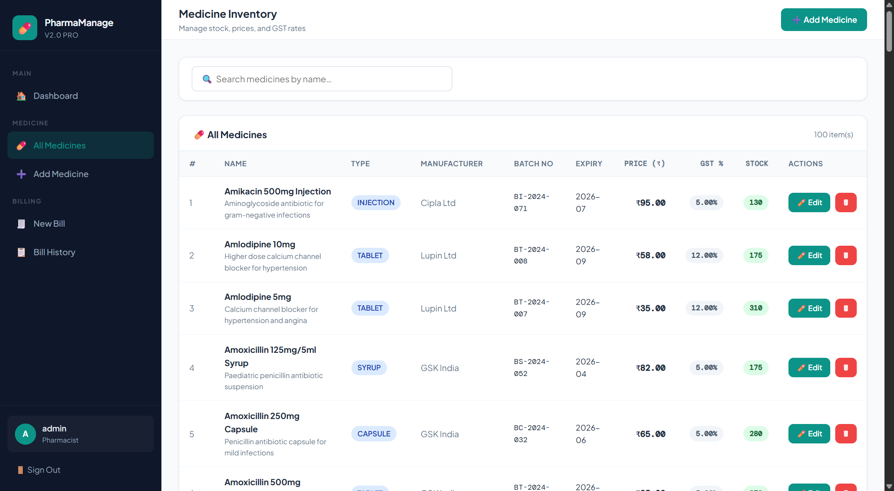

# 💊 Pharmacy Management System

A **modern web-based Pharmacy Management System** built using **Java, Servlet, JSP, and MySQL** to digitally manage pharmacy operations such as **medicine inventory, billing, and stock tracking**.

The system replaces traditional manual registers with an **efficient digital workflow**, helping pharmacy staff manage medicines, track stock levels, and generate bills quickly and accurately.

> ⚠️ This project is developed for **learning, demonstration, and academic purposes**.

---

# 🚀 Features

### 💊 Medicine Management

* Add new medicines
* Update medicine details
* Delete medicines
* Manage medicine categories
* Track manufacturer and batch details

### 📦 Inventory Management

* Real-time stock tracking
* Low stock detection
* Expiry date monitoring
* Prevent negative stock during billing

### 🧾 Billing System

* Generate pharmacy bills
* Automatic GST calculation
* Patient information support
* Bill history tracking
* Invoice print support

### 📊 Dashboard

* Total medicines count
* Low stock alerts
* Total bills
* Daily sales overview

### 🔍 Search & Filtering

* Search medicines instantly
* View detailed medicine inventory
* Manage stock efficiently

### 🔐 Authentication

* Secure login system
* Session management
* Admin / Staff access

---

# 📸 Application Screenshots

## Dashboard



Displays pharmacy overview including **medicine inventory, low stock alerts, and daily sales statistics**.

---

## Medicine Inventory



View all medicines with details such as:

* Medicine Name
* Type
* Manufacturer
* Batch Number
* Expiry Date
* Price
* GST
* Stock Quantity

---

## Add Medicine


Add new medicines with:

* Manufacturer
* Batch Number
* Expiry Date
* Unit Price
* GST Percentage
* Stock Quantity

---

## New Billing


Generate medicine bills with:

* Patient details
* Medicine selection
* Quantity calculation
* GST calculation
* Automatic bill summary

---

## Invoice


Generate a **clean printable invoice** including:

* Pharmacy details
* Patient information
* Medicine list
* GST breakdown
* Grand total

---

# 🧠 System Overview

The system allows pharmacy staff to:

* Maintain medicine inventory
* Track stock availability
* Process medicine sales
* Generate invoices
* Store billing records

It is designed to be **simple, fast, and easy to use**, making it ideal for **small pharmacies and academic demonstrations**.

---

# 🛠️ Technology Stack

### Backend

* Java
* Servlet
* JSP
* JDBC

### Frontend

* HTML
* CSS
* JavaScript

### Database

* MySQL

### Server

* Apache Tomcat

### Architecture

MVC (Model – View – Controller)

---

# 🏗️ System Architecture

```
Client (Browser)
        ↓
JSP (View Layer)
        ↓
Servlet (Controller Layer)
        ↓
DAO / Service Layer
        ↓
MySQL Database
```

### Design Principles

* Separation of concerns
* Modular architecture
* Maintainable codebase
* Scalable structure

---

# 📁 Project Structure

```
Pharmacy-Management-System
│
├── controller/
│   ├── AuthController.java
│   ├── BillingController.java
│   └── MedicineController.java
│
├── dao/
│   ├── MedicineDAO.java
│   └── BillingDAO.java
│
├── model/
│   ├── Medicine.java
│   ├── Bill.java
│   └── User.java
│
├── util/
│   └── DBConnection.java
│
├── web/
│   ├── jsp/
│   │   ├── dashboard.jsp
│   │   ├── medicines.jsp
│   │   ├── billing.jsp
│   │   └── login.jsp
│   │
│   ├── css/
│   └── js/
│
└── database/
    └── pharmacy.sql
```

---

# ⚙️ Installation Guide

### 1️⃣ Clone Repository

```
git clone https://github.com/rezaul-code/pharmacy-management-system.git
```

---

### 2️⃣ Import Project

Open the project in:

* IntelliJ IDEA
* Eclipse
* VS Code (with Java extensions)

---

### 3️⃣ Setup Database

Create a MySQL database:

```
CREATE DATABASE pharmacy_db;
```

Import the provided SQL file.

---

### 4️⃣ Configure Database Connection

Update:

```
DBConnection.java
```

```
jdbc:mysql://localhost:3306/pharmacy_db
username: root
password: yourpassword
```

---

### 5️⃣ Run Project

Deploy on:

```
Apache Tomcat Server
```

Access the application:

```
http://localhost:8080/pharmacy-management-system
```

---

# 🔐 Security Features

* Session-based authentication
* Input validation
* Secure logout
* Controlled admin access

---

# 🔮 Future Improvements

* Expiry alerts
* Low stock notifications
* Role-based access control
* Export invoices to PDF
* REST API integration
* Spring Boot migration
* Cloud deployment
* Android application version

---

# 👨‍💻 Author

**Rezaul Karim Khan**

Software Engineer | Java | Spring Boot | Full Stack Development

🌐 Portfolio
https://rezaul.online

💻 GitHub
https://github.com/rezaul-code

🔗 LinkedIn
https://linkedin.com/in/rezaul-khan

---

# 📜 License

This project is licensed for **educational and demonstration purposes**.

---

# ⭐ Support

If you like this project, please **star the repository** ⭐ on GitHub.
